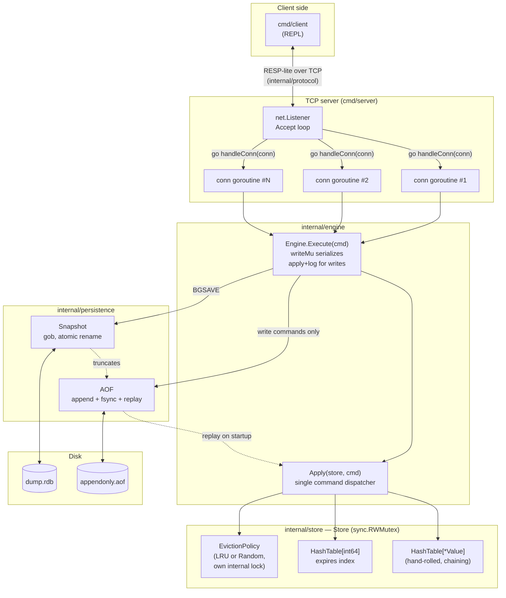

# goredis

A Redis-like in-memory key-value store, built from scratch in Go as a systems-design portfolio piece. The core storage engine — the hash table, the LRU eviction structure, everything under `internal/store` — uses **no built-in Go `map`**. Hashing, collision resolution, resizing, TTL tracking, and LRU recency are all hand-rolled data structures, on purpose, so every part of it can be explained and defended in an interview.

```
go build ./cmd/server && go build ./cmd/client
./server &
./client
```

## Contents

- [What it does](#what-it-does)
- [Architecture](#architecture)
- [Package layout](#package-layout)
- [Design decisions](#design-decisions)
  - [The hash table](#the-hash-table)
  - [Thread safety](#thread-safety)
  - [TTL / expiry](#ttl--expiry)
  - [Eviction](#eviction)
  - [Persistence](#persistence)
  - [Networking](#networking)
- [Setup & usage](#setup--usage)
- [Commands](#commands)
- [Testing](#testing)
- [Benchmarks](#benchmarks)
- [What I'd change for production](#what-id-change-for-production)

## What it does

- **Storage**: strings and lists, in a hand-written separate-chaining hash table with power-of-two bucket sizing and load-factor-triggered resizing.
- **Concurrency**: safe for many goroutines to hit at once, via `sync.RWMutex` at the store layer (readers run in parallel; writers are exclusive).
- **TTL**: `EXPIRE`/`TTL`, with both lazy expiration (checked on access) and a background goroutine that actively sweeps expired keys.
- **Eviction**: LRU (hash map + doubly linked list, built by hand) or random, selectable via config, triggered by a configurable max-keys and/or approximate max-memory limit.
- **Persistence**: an append-only command log (AOF) replayed on startup, plus a `BGSAVE`-style compact snapshot that lets the AOF be truncated (an "AOF rewrite").
- **Networking**: a raw TCP server, one goroutine per connection, speaking a small RESP-lite wire protocol, with a minimal CLI client to drive it interactively.

## Architecture



**Why this shape, specifically:** `Apply(store, cmd)` is the *only* place command semantics live. Both live client traffic (via `Engine.Execute`) and AOF replay at startup call the exact same function, so there is no second implementation of "what does SET actually do" to accidentally drift out of sync with the first. `Engine` is the thin layer that adds persistence (and nothing else) on top of that; `Server` is a thin layer that adds TCP framing (and nothing else) on top of `Engine`. Each layer only knows about the one below it.

### The hash table and LRU list, concretely

This is the part meant to be whiteboardable from memory:

```
HashTable (separate chaining, capacity is always a power of two)

  buckets[0] -> nil
  buckets[1] -> ["b"] -> ["f"] -> nil     (collision chain, newest prepended)
  buckets[2] -> ["a"] -> nil
  ...
  buckets[N-1] -> nil

  index = hash(key) & (capacity - 1)      // power-of-two mask, not %
  resize: when entries/capacity > 0.75, capacity *= 2, rehash everything

LRU policy (hash map + doubly linked list, both hand-rolled)

  nodes: HashTable[key -> *lruNode]     (O(1) "find this key's list node")

  head <-> [c] <-> [a] <-> [d] <-> tail
           MRU                  LRU

  Touch(k):  look up node via `nodes`, unlink, relink at head   — O(1)
  Evict():   victim = tail.prev (LRU end, by construction)      — O(1)
  head/tail are sentinel nodes — every real node always has a
  non-nil prev/next, so unlink/insert never special-cases empty/
  first/last.
```

## Package layout

```
cmd/
  server/            binary: TCP server entrypoint, flags, graceful shutdown
  client/            binary: minimal redis-cli-style REPL

internal/
  store/             the storage engine — no builtin map anywhere in here
    hashtable.go        HashTable[V] — generic, hand-rolled, chaining + resize
    value.go            Value — tagged union (string | list)
    store.go            Store — RWMutex-guarded typed API (SET/GET/DEL/...)
    expiry.go            lazy + active TTL expiration
    eviction.go          EvictionPolicy interface, Config
    lru.go               LRU policy: hash map + doubly linked list
    random.go            random-eviction policy: slice + swap-remove
    snapshot.go          Store <-> []Entry (encoder-agnostic) for BGSAVE
    errors.go            ErrWrongType

  protocol/          the wire format — used by both the AOF and the TCP server
    protocol.go          Command; RESP-lite request encode/decode
    reply.go             Reply; RESP-lite reply encode/decode

  engine/            the one place a Command is turned into a Store mutation
    apply.go             Apply(store, cmd) — the command dispatcher
    result.go            Result — typed return value
    engine.go            Engine — Store + AOF + snapshot, writeMu ordering

  persistence/       disk I/O only — no command semantics in here
    aof.go               AOF — append/replay/truncate
    snapshot.go          gob snapshot save/load, atomic rename

  server/            TCP front end
    server.go            goroutine-per-connection Server
```

## Design decisions

### The hash table

`internal/store/hashtable.go` implements `HashTable[V any]` — generic over the value type so the exact same implementation backs both the main `key -> *Value` table and the `key -> int64` TTL index (see [TTL / expiry](#ttl--expiry)), instead of a second bespoke structure or a builtin map for the latter.

- **Separate chaining, not open addressing.** Deletion is a straightforward unlink; open addressing needs tombstones or backward-shift deletion to avoid corrupting later probe sequences, which is a much easier place to introduce a subtle bug. Chaining also degrades gracefully past load factor 1.0 (chains just get a bit longer), where open addressing must stay well under 1.0 or performance falls off a cliff. The cost is pointer-chasing/cache-unfriendliness relative to open addressing.
- **FNV-1a, implemented by hand.** For every byte: XOR into the running hash, then multiply by a prime. It's not `hash/fnv` — the point was to have the whole algorithm visible and explainable, not to reuse a library. FNV-1a is *not* DoS-resistant (an attacker who can choose keys could craft collisions); production Redis uses SipHash for exactly that reason. That's a known, named tradeoff here, not an oversight.
- **Power-of-two capacity, mask instead of modulo.** `index = hash & (capacity - 1)` is one instruction; `hash % capacity` is comparably expensive, especially for a `uint64`. This only works correctly because capacity is *always* a power of two — resizing always doubles.
- **Resize is a full rehash, triggered at load factor 0.75.** Any single `Set` can cost O(n) if it happens to trigger a resize, but because capacity doubles each time, the total cost of all resizes across n insertions is O(n) — the same amortized argument that justifies Go's own slice `append`.

### Thread safety

A single `sync.RWMutex` in `Store` guards the whole data table for every operation — deliberately coarse, not sharded:

- **Why not `sync.Map`:** its own documentation says it's optimized for keys that are mostly written once and read many times by disjoint goroutines. A KV store gets the *same* hot keys read and written constantly — exactly the pattern `sync.Map`'s docs warn performs worse than a plain map (or, here, hash table) plus a mutex.
- **Why not sharded/striped locks** (e.g. Java's `ConcurrentHashMap` style): more parallelism, but at real cost — `KEYS`, `FLUSHALL`, a hash table resize, and `BGSAVE`'s snapshot all need a consistent view across the *entire* table. Under sharding those would need every shard's lock anyway, which erases most of the benefit while adding real correctness surface area (deadlock ordering across shards, etc).
- **`RWMutex`, not plain `Mutex`, specifically because reads dominate.** `GET`/`EXISTS`/`KEYS` all take `RLock`, so any number of readers proceed concurrently; only a writer (`SET`, `DEL`, `LPUSH`, ...) needs the exclusive lock.
- **The hash table itself has no internal lock at all** — same as Go's own builtin `map`. Locking is Store's job, one layer up, so the table's own logic (hashing, chaining, resizing) never has to reason about concurrency.
- **Eviction policies (LRU/random) hold their own separate internal mutex**, independent of `Store.mu`. This one is worth spelling out: recording LRU recency is a *mutation* of a linked list, but `Get` only needs `Store`'s *read* lock to read a value. If recency tracking shared `Store.mu`, every `GET` would need the exclusive write lock just to bump a key to the front of the LRU list — exactly the read/write contention `RWMutex` exists to avoid. Giving each policy its own small lock means `GET` holds `Store.mu.RLock()` for the data read and, separately and briefly, the policy's own lock for the touch. Lock ordering is one-directional (`Store` calls into a policy, never the reverse), so this can't deadlock.
- **`Engine` adds one more lock, `writeMu`, around "apply to the store, then append to the AOF."** `Store`'s own mutex already fully serializes writes to the data structure — this isn't adding contention that wasn't already there. What it closes is the gap *between* those two steps: without it, two concurrent writers could apply to the store in one order but log to the AOF in the other, so a crash-recovered replay could silently diverge from what the live store actually held. This is covered by an actual regression test (30 goroutines × 50 writes, replay diffed against live state — see [Testing](#testing)), not just an assertion.

### TTL / expiry

`internal/store/expiry.go`. TTLs are tracked in a **separate `HashTable[int64]`** (`key -> absolute expiry, Unix ns`), not as a field on every `Value` — mirroring Redis's own real design of a distinct "expires" dictionary, so the active sweeper only ever walks keys that can actually expire, not the whole keyspace.

**Lazy expiration and active expiration do different jobs, deliberately decoupled:**

- *Lazy* (`isExpired`, checked inline by `Get`/`Exists`/`Keys`/`LLen`/`LRange`) only decides **visibility** — "should the caller be told this key exists" — and never deletes anything. It's safe to call under `RLock`. This is the subtle part: Go's `RWMutex` can't be atomically upgraded from a read lock to a write lock, so if a read command found an expired key and wanted to *delete* it inline, it would have to drop the read lock and reacquire the write lock (with a re-check, since state could have changed in between) — forcing every read of an expired key onto the exclusive-lock path. Instead, an expired key is just reported as "not found" under the read lock; physical removal is left to the active sweeper, or to the next write-lock-holding command that happens to touch that same key anyway (`getOrCreateList`, `Expire` both opportunistically reclaim while they're already holding the lock). This is the same idea as tombstones / MVCC visibility in a real database, applied at a much smaller scale.
- *Active* (`runActiveExpiry`, a `time.Ticker` in a background goroutine, default 100ms — the same cadence as Redis's own housekeeping cron) walks only the expires index, collects expired keys, then physically deletes them from the data table, the expires index, and the eviction policy. It exists so a key that's set-once-and-never-read-again still gets its memory reclaimed, instead of leaking forever under lazy-only expiration.
- Shutdown of the sweeper goroutine uses the **channel-as-signal** pattern: `close(stopSweep)` wakes a blocked `select` regardless of timing (unlike sending a value, which only one waiting receiver would get), and `Close()` blocks on a second channel (`sweepDone`) until the goroutine has actually observed the signal and returned — not just assuming it will.
- A real simplification, named rather than hidden: the sweep is a **full scan** of the expires index, not Redis's random-sampling algorithm (check ~20 keys, keep sampling if >25% were expired). A full scan is O(keys-with-a-TTL), which is fine at this scale and much easier to verify correct; sampling would be a one-function change on top of the same index if this needed to handle millions of TTL'd keys.

### Eviction

`internal/store/eviction.go`, `lru.go`, `random.go`. Eviction is triggered from `Set`/`LPush`/`RPush` (any write that can grow the store), via `enforceLimits()`, running inside the *same* write-lock critical section as the write that triggered it — necessary so a burst of concurrent writers can't all observe "over limit" and each independently evict, overshooting well below the configured limit.

- **LRU** (`lru.go`): hash map + doubly linked list, both hand-built (the hash map is `HashTable[*lruNode]`, the same generic table as everywhere else). Two sentinel nodes (`head`, `tail`) mean every real node always has a non-nil `prev`/`next`, so unlink/insert-at-front never special-cases an empty list or the first/last element. `Touch`, `Evict`, and `RemoveKey` are all O(1).
- **Random** (`random.go`): an unordered `[]string` of tracked keys plus a `HashTable[int]` mapping key → its index in that slice, which enables O(1) removal via the classic swap-with-last-element-then-shrink trick (order doesn't matter, since eviction picks a uniformly random index anyway).
- **The tradeoff between them, honestly stated:** LRU actively protects hot keys and gives a measurably better hit rate under any workload with locality (some keys hot, most cold — the common case). Random eviction's `Touch` does strictly less work per access (no relinking), so it has a lower constant-factor overhead under very high read throughput, and it genuinely wins — not just "is simpler" — when access patterns have *no* locality at all, where LRU's bookkeeping buys nothing.
- **A config flag, not a rebuild, switches between them:** `Config.EvictionPolicy` (`EvictionLRU` / `EvictionRandom`), passed to `store.NewWithConfig`, or `-eviction-policy lru|random` on the server binary.
- **Interaction with TTL:** a key that's already logically expired doesn't count against `MaxKeys` "forever" — it's excluded from view immediately (lazy expiration) and physically stops being tracked by the eviction policy as soon as either the active sweeper or an opportunistic cleanup removes it, so it can't crowd out live keys while waiting to be swept.
- **`MaxMemoryBytes` is an approximate, incrementally-maintained counter** of key+value content bytes — explicitly *not* real Go runtime memory (no struct headers, pointer overhead, hash table bucket allocation, or GC overhead counted). Byte-exact accounting would mean hooking the allocator or sampling `runtime.MemStats`, both expensive per-write and famously imprecise for attributing "how much did *this* key cost." This is the same tradeoff most real LRU-cache libraries make.

### Persistence

`internal/persistence/`, `internal/engine/`. Two mechanisms, doing different jobs:

- **AOF (append-only file):** every successful write command is encoded (via `internal/protocol`, the same RESP-lite codec the TCP server uses for requests) and appended to disk, fsync'd before `Append` returns. Fsync-on-every-write is real Redis's `appendfsync always` mode — the simplest durability policy to reason about (nothing written can be lost), at a real throughput cost (one disk flush per write) that Redis's own default (`everysec`, batching a second's worth of writes between flushes) exists specifically to avoid. That's a deliberate choice for correctness-first clarity here, named as the first thing to change for a write-heavy production workload.
- **Snapshot (`BGSAVE`):** dumps the store's *entire current state* (via `Store.Snapshot()`, a flat `[]Entry` — plain data, no pointers into live store internals) to disk with `encoding/gob`, then truncates the AOF. This is the "AOF rewrite" story: once the snapshot fully captures current state, every command that produced that state is redundant — a fresh restart only needs the snapshot plus whatever gets written *after* this point, not the entire history back to the beginning.
- **Why both, not just one:** an AOF alone means startup replay time grows unboundedly with the store's write history, even if 99% of those writes have long since been overwritten or deleted. A snapshot alone (no AOF) means every write between snapshots is lost on a crash. Together: startup is "load the (bounded-size) snapshot, replay the (short, since-last-BGSAVE) AOF tail" — bounded replay time *and* durability of recent writes.
- **The snapshot write is atomic**: gob-encode to a `.tmp` file in the same directory, fsync, close, then `os.Rename` onto the real path. A rename within one filesystem is atomic, so a crash at any point before it leaves the *previous* snapshot completely untouched — there's no window where the snapshot file exists but is half-written.
- **AOF replay tolerates a truncated final command** — the on-disk signature of a crash mid-`Append` — by decoding everything up to that point and stopping cleanly rather than failing the whole load. `protocol.Decode` distinguishes a clean end-of-stream (`io.EOF`) from a truncation mid-command (`io.ErrUnexpectedEOF`) specifically so `Replay` can tell these apart.
- **`Engine.writeMu` also guards `BGSave`**, not just `Execute`: while a snapshot is being taken and the AOF truncated, no other write can be applied-and-logged, so there's no window where a write lands after `Snapshot()` reads the store but the AOF has already been truncated (which would silently lose it). Real Redis's `BGSAVE` instead forks a child process, so the parent keeps serving writes uninterrupted via copy-on-write memory pages — Go has no `fork()`, and goroutines share memory, so that trick isn't available here. Blocking writes for the (typically fast, in-memory) duration of a snapshot is the honest, simple alternative; it's a real tradeoff (a brief write-pause proportional to store size), named directly rather than glossed over, and is the main thing a production-grade rewrite of this project would need a different approach for.

### Networking

`internal/server/`, `cmd/server/`, `cmd/client/`.

- **Goroutine-per-connection**, not thread-per-connection (the equivalent pattern in Java/C) and not an event loop. This is the actual, concrete reason it holds up under load in Go specifically:
  - A goroutine starts with a ~2KB stack that grows and shrinks on demand; an OS thread reserves a fixed stack up front, often 1–8MB. Ten thousand idle connections as goroutines costs tens of MB; as OS threads it can mean tens of GB reserved before any of them do anything.
  - Goroutines are scheduled **M:N** onto a small number of OS threads by the Go runtime. Blocking on a slow client's socket read parks that one goroutine cheaply, instead of tying up a kernel thread (thread-per-connection) or forcing every handler into non-blocking, callback/future style just to avoid tying one up (an event loop). Plain, blocking, synchronous-looking code — one goroutine, one connection, a `for` loop reading commands — is simultaneously the simplest code to write *and* the code that scales to high concurrency here, which isn't true in most other languages: normally you pick one or the other.
- **RESP-lite wire format** (`internal/protocol`): requests are a length-prefixed array of bulk strings (`*<argc>\r\n$<len>\r\n<bytes>\r\n...`), the same shape real Redis uses for client requests, scaled down. This wasn't optional — it's what makes the AOF byte-safe for values containing spaces or newlines, which a naive space-delimited line format would corrupt. Replies use RESP's small set of scalar types (`+OK`, `-ERR`, `:123`, `$3\r\nfoo\r\n`, `$-1` for nil, `*N\r\n...` for arrays).
- **A protocol decode error closes the connection**, rather than trying to resynchronize. Once framing is lost there's no reliable way to find the next command boundary in the byte stream — silently continuing risks misinterpreting later bytes as an unrelated command, which is worse than dropping the connection.
- **Graceful shutdown** (`Server.Shutdown`): stop accepting new connections, force-close every currently-open connection (which unblocks each connection goroutine's in-flight `Read`, so its loop exits), then `sync.WaitGroup.Wait()` for every connection goroutine to actually finish — so by the time `Shutdown()` returns, nothing can still be calling into the engine, and it's safe to close the AOF file handle and stop the background expiry goroutine right after. `cmd/server` wires this to `SIGINT`/`SIGTERM`.
  - This shutdown path had a real, `go test -race`-caught bug during development: the listener field was written by the accept loop and read/closed by `Shutdown` with no synchronization, and — a correctness bug beyond just the race — a shutdown signal arriving *before* the listener finished binding could be silently missed entirely. Fixed by moving the listener under the same mutex as the connection set and checking the shutdown signal in that same critical section right after binding. Verified against the real compiled server binary receiving a real `SIGTERM`, not just in a unit test.

## Setup & usage

Requires Go 1.21+ (generics; developed against 1.27).

```bash
# Build both binaries
go build -o server ./cmd/server
go build -o client ./cmd/client

# Or run directly without building
go run ./cmd/server -addr :6380 -data-dir ./data
go run ./cmd/client -addr 127.0.0.1:6380
```

Server flags:

| Flag | Default | Meaning |
|---|---|---|
| `-addr` | `:6380` | TCP address to listen on |
| `-data-dir` | `data` | directory for `appendonly.aof` and `dump.rdb` |
| `-max-keys` | `0` (unlimited) | evict once the store holds more than this many keys |
| `-max-memory-mb` | `0` (unlimited) | evict once approximate content size exceeds this |
| `-eviction-policy` | `lru` | `lru` or `random` |

Example session:

```
$ ./server -addr :6380 -data-dir ./data -max-keys 1000 &
$ ./client -addr 127.0.0.1:6380
connected to 127.0.0.1:6380. Commands: SET GET DEL EXISTS KEYS FLUSHALL EXPIRE TTL LPUSH RPUSH LLEN LRANGE BGSAVE. Type QUIT to exit.
goredis> SET greeting "hello world"
OK
goredis> GET greeting
"hello world"
goredis> EXPIRE greeting 60
(integer) 1
goredis> TTL greeting
(integer) 60
goredis> RPUSH fruits apple banana cherry
(integer) 3
goredis> LRANGE fruits 0 -1
1) "apple"
2) "banana"
3) "cherry"
goredis> BGSAVE
OK
goredis> QUIT
```

Data written this way survives a restart: `SIGINT`/`SIGTERM` triggers a graceful shutdown, and the next `./server` run with the same `-data-dir` replays the snapshot + AOF tail automatically.

## Commands

| Command | Args | Notes |
|---|---|---|
| `SET` | `key value` | overwrites any existing value/type and clears any existing TTL |
| `GET` | `key` | `WRONGTYPE` error if key holds a list |
| `DEL` | `key [key ...]` | returns count actually removed |
| `EXISTS` | `key [key ...]` | returns count present (duplicates counted) |
| `KEYS` | *(none)* | returns every live key |
| `FLUSHALL` | *(none)* | removes everything |
| `EXPIRE` | `key seconds` | returns 1 if the key existed, else 0 |
| `TTL` | `key` | seconds remaining; `-1` no TTL set; `-2` key doesn't exist |
| `LPUSH` / `RPUSH` | `key value [value ...]` | creates the list if absent; returns new length |
| `LLEN` | `key` | 0 if the key doesn't exist |
| `LRANGE` | `key start stop` | negative indices count from the end, Redis-style |
| `BGSAVE` | *(none)* | snapshot current state to disk and truncate the AOF |

## Testing

```bash
go test ./...            # all unit + integration tests
go test ./... -race      # same, with the race detector (this is the one that matters)
go vet ./...
```

92 tests across every package, all green under `-race`. Highlights, by what each is actually trying to catch:

- **`internal/store/hashtable_test.go`** forces genuine hash collisions (brute-searches for real keys that land in the same bucket under the actual `hashKey`/`hashToIndex`, rather than faking a collision) and deletes the head, middle, and tail of that chain, to prove unlinking doesn't corrupt neighboring entries. Separately, 5,000 inserts to exercise several resizes and confirm nothing is lost or misplaced during rehashing.
- **`internal/store/expiry_test.go`** keeps lazy and active expiration provably distinct: one test confirms a lazily-expired key is invisible to `Get`/`Exists`/`Keys` while whitebox-checking it's *still physically present* in the table (proving lazy expiration only affects visibility); another confirms the active sweeper does physically remove it, polling until it's gone.
- **`internal/protocol/protocol_test.go`** brute-forces every possible truncation point of an encoded command and asserts each one produces `io.ErrUnexpectedEOF`, never a false-clean `io.EOF` or a silent misparse — this is what makes AOF crash-tolerance trustworthy rather than just asserted.
- **`internal/engine/engine_test.go`** has the regression test for the exact bug `Engine.writeMu` exists to prevent: 30 goroutines × 50 writes each on 30 shared keys, then the AOF is replayed into a fresh store and diffed key-by-key against what the live store actually ended up holding.
- **`internal/server/server_test.go`** is the integration test: a real `Server` on a real OS-assigned loopback port, driven by real `net.Dial` connections using the exact `protocol.Encode`/`protocol.ReadReply` calls the CLI client makes (not calling into `Store`/`Engine` directly), through a full command sequence, plus 25 concurrent client connections each doing an independent `SET`+`GET`.

## Benchmarks

Measured with `go test ./internal/store -bench=. -benchtime=300ms` (sequential) and `-cpu=1,2,4,8` (parallel), on an Apple M3 (8 cores). Keys are pre-generated outside the timed region so string formatting isn't mistaken for store overhead.

**Sequential** (single goroutine) — the "is this actually O(1)" claim, checked empirically:

| Op | 1K keys | 100K keys | 1M keys |
|---|---:|---:|---:|
| `SET` | 40.9 ns/op | 52.4 ns/op | 111.6 ns/op |
| `GET` | 23.1 ns/op | 26.4 ns/op | 72.2 ns/op |

Timing stays flat-ish across a 1,000x increase in table size — mild growth from cache effects at larger sizes, not the linear scaling a non-hash-table structure would show.

**Parallel**, ns/op by `GOMAXPROCS` (1M-key table; lower is better aggregate throughput):

| Op | -cpu=1 | -cpu=2 | -cpu=4 | -cpu=8 |
|---|---:|---:|---:|---:|
| `SET` | 167.4 | 187.7 | 195.6 | 206.3 |
| `GET` | 84.5 | 113.1 | 152.7 | 151.4 |

`SET` getting *slower* in aggregate as concurrency rises is expected — `Set` takes `Store`'s exclusive write lock, so more goroutines just means more waiting, not more throughput.

`GET` doing the same thing is the more interesting result, and I didn't go in assuming it: parallel `GET` throughput is *worse* at `-cpu=8` than a single goroutine reading alone, even though reads only take a shared `RLock`. The reason is that `sync.RWMutex` still does atomic bookkeeping on an internal reader counter on every `RLock`/`RUnlock`, and that counter is one shared cache line every reading goroutine contends on — more cores means more cross-core cache-coherency traffic on that single counter, which can outweigh the fact that the actual data access itself has no lock conflict. It's a well-known `RWMutex` gotcha in Go, and the honest answer for a store that actually needed read throughput to scale across many cores is sharding into multiple independently-locked partitions (or a lock-free/RCU-style read path), not a single global `RWMutex` — which is exactly what real Redis-scale systems do, and what I'd reach for first if this needed to go further.

## What I'd change for production

Named throughout the code and this doc rather than hidden, collected here:

- **SipHash instead of hand-rolled FNV-1a**, to remove the hash-flooding DoS surface of a hasher an attacker could target with chosen keys.
- **Sharded/striped locking** (or a lock-free read path) instead of one global `RWMutex`, once read throughput needs to scale past what a single reader-counter cache line can sustain across many cores (see [Benchmarks](#benchmarks)).
- **Random-sampling active expiry** (à la Redis: sample ~20 keys with a TTL, keep sampling if >25% were expired) instead of a full scan of the expires index, so a single sweep tick stays roughly constant time even with millions of keys carrying a TTL.
- **`appendfsync everysec`** as an option instead of always-fsync, trading a small, bounded durability window for meaningfully better write throughput under load.
- **Fork-based (or copy-on-write) `BGSAVE`** instead of blocking writes for the snapshot's duration — not available for free in Go the way it is via `fork()` in C, but achievable with a copy-on-write-friendly structure.
- **`KEYS` pattern matching** (glob-style, like real Redis) instead of always returning every key.
